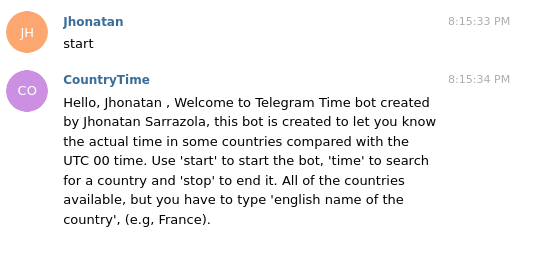
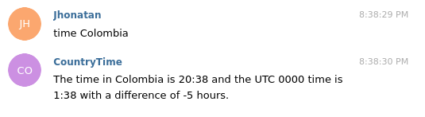
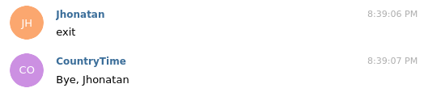

# Telegram-Bot





> This is a script file to house my Ruby Capstone project "Telegram Bot".

## Built With

- Ruby -v2.7.0p0
- Rubocop
- Rspec
- Telegram-bot

## Getting Started

To get a local copy, copy up and running follow these simple example steps.

- Open the terminal and clone the repository with one of the next commands:
- Clone it if using HTTPS with the command `git clone https://github.com/jssarrazolaa/Telegram-Bot.git`
- Clone it if using SSH with the command `git clone git@github.com:jssarrazolaa/Telegram-Bot.git`

### Prerequisites

- Ruby -v 2.7.x
- Telegram account

### Setup

- Open the terminal
- Go to the root folder of the cloned repository.
- Run the comman `bundle install`
- Run the program with this code: `ruby bin/main.rb`
When runing:
- Go to the page [CountryTime]('https://web.telegram.org/#/im?p=@CountryTimebot') and folow the instructions below in Usage section.

### Usage

- Follow the instuctions:

- The URL above will open a Telegram chat with the bot.
- Enter the command `start` to see how the Bot works.
- Enter `phrase` to receive a random phrase.
- Enter `time Country_Name` to see the current time in that country and the difference with the UTC time.
- Enter `stop` or `exit` to turn off the bot.

### Automated Tests

- In root directory copy this:
            ```
            cd spec
            ```
- In your terminal copy this code to test the methods:
            ```
            rspec enumerable_spec.rb
            ```
- If one of the methods is not working it will show you this error example:

            Failures:

               1) Methods token returns the token
                    Failure/Error: expect(method.token).to be false
                    
                    expected false
                         got #<String:1320> => "1169735408:AAFB1CCrgujdVmwUANIQgS8MTKGvUy4ZrYk"
                    # ./methods_spec.rb:22:in `block (3 levels) in <top (required)>'

               Finished in 0.01663 seconds (files took 0.09608 seconds to load)
               3 examples, 1 failure

               Failed examples:

               rspec ./methods_spec.rb:21 # Methods token returns the token
                        

## Author


👤 **Jhonatan Sarrazola**

- Github: [@jssarrazolaa](https://github.com/jssarrazolaa)
- Twitter: [@StevenAlvarez_](https://twitter.com/StevenAlvarez_)
- Linkedin: [Jhonatan Sarrazola](https://www.linkedin.com/in/jhonatan-sarrazola-6a46a01a5/)

## 🤝 Contributing

Contributions, issues and feature requests are welcome!


## Show your support .

Give a ⭐️ if you like this project!

## Acknowledgments

- Microverse Team 138 (The Atlas)

## 📝 License

This project is [MIT](lic.url) licensed.
